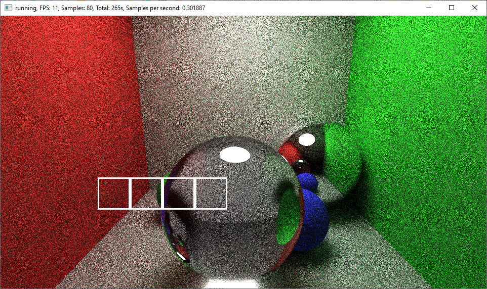

# Pathtracer1

A multithreaded CPU based Monte Carlo Pathtracer showing the rendered image while rendering it.
It supports diffuse, glossy, translucent and emissive materials.
The scene, resolution, thread count, save file and other options have to configured in the source code and the program has to be rebuilt.

# Example

The four white squares are the chunks currently being processed in parallel.

# Controls
- Space - Pause/Resume rendering
- F1 when paused - save image