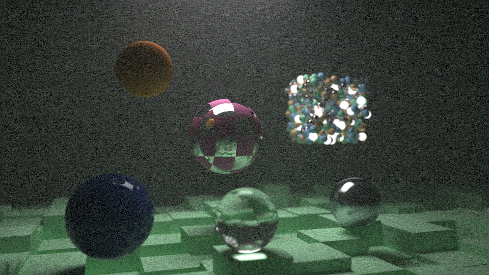

# Pathtracer2

This project was developed following the books from [Raytracing in one Weekind](https://raytracing.github.io/)

A multithreaded CPU based Monte Carlo Pathtracer.
It supports multiple material types (diffuse, glossy, translucent, emissive), texture types (constant color, checkerboard), object types (spheres, boxes, planes, BHVs), homogeneous media and depth of field.
It also supports switching between using single precision and double precision floats at compile time.

The scene, resolution, thread count, block size, sample count etc. have to be configured in the source code.

# Examples

